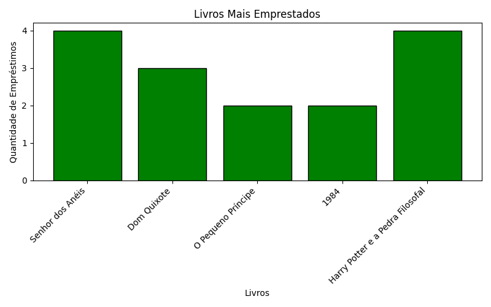

# big-data

## Como rodar o projeto

1. **Instale o Python**
     ```sh
     sudo apt update
     sudo apt install python3.12 python3.12-venv
     ```

2. **Crie e ative um ambiente virtual**
   ```sh
   python3 -m venv venv
   source venv/bin/activate
   ```

3. **Instale as dependências**
   ```sh
   pip install matplotlib
   ```

4. **Execute o projeto**
   ```sh
   python books.py
   ```

## Gráfico


